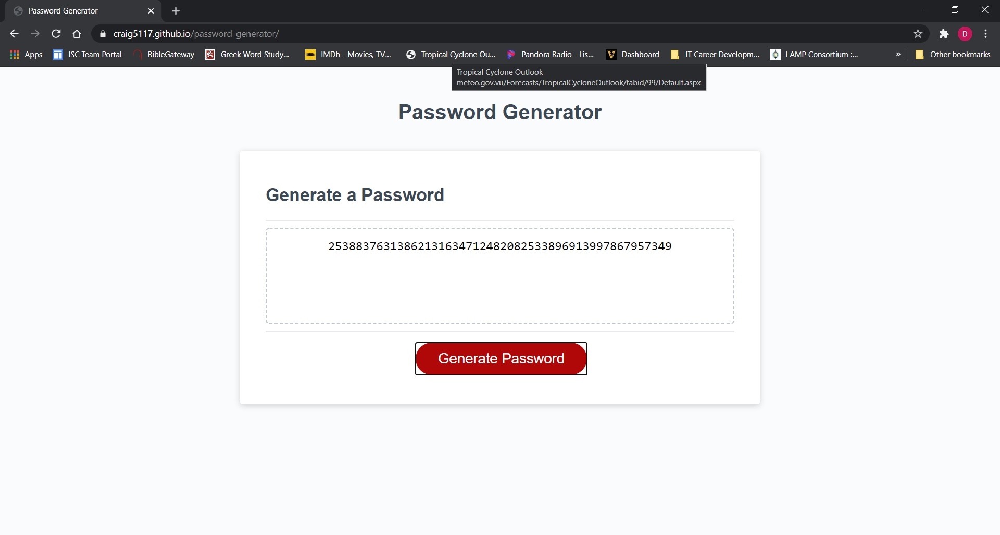

# Password Generator

## Purpose
An application for generating random passwords.

### Table of Contents
- [Built With](#built-with)
- [Contribution](#contribution)
    - [Author Contact Info](#author-contact-info)
- [Features](#features)

## Built With
- HTML
- CSS
- **Javascript**

[Back to Contents](#table-of-contents)

---

## Website
https://craig5117.github.io/password-generator/

[Back to Contents](#table-of-contents)

---

## Contribution

Javascript by **Craig Bennett**.

### Author Contact Info:

GitHub: https://github.com/Craig5117

LinkedIn: https://www.linkedin.com/in/craig-bennett-852a571b4/

[Back to Contents](#table-of-contents)

---

## Features
- User can choose to include lowercase, uppercase, numeric, or special characters.
- User can set a password length between 8-128 characters.

[Back to Contents](#table-of-contents)